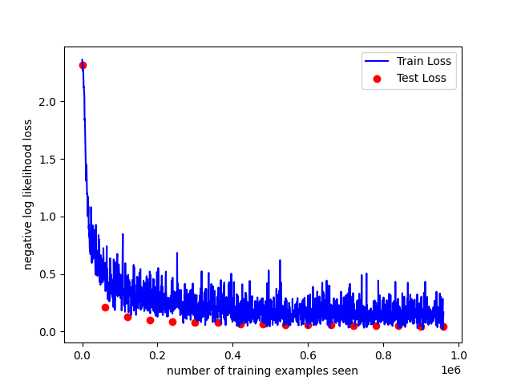
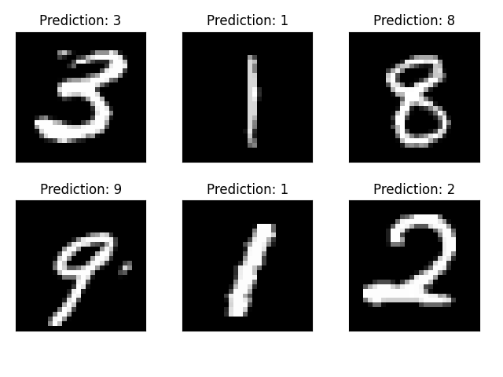
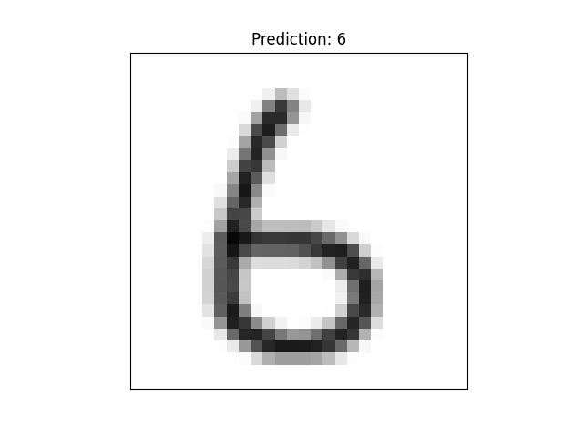

# Pytorch_Template
This is a template you can use for your Pytorch projects.

I mainly made this for my own usage, but I thought it might be useful for others as well.

## Features
- [x] Training w/ logging and checkpointing (todo)
- [x] Testing on single images, with examples
- [x] Classes for hyperparameters, models and previously trained models.
- [x] Helper methods for visualizing parameters, test results and data.
- [x] More to come(?)

For example usage, see the 'main_mnist_example.py' file.
I am too lazy to write proper docs.

## Example training plot

## Example prediction samples

## Example prediction on single image
